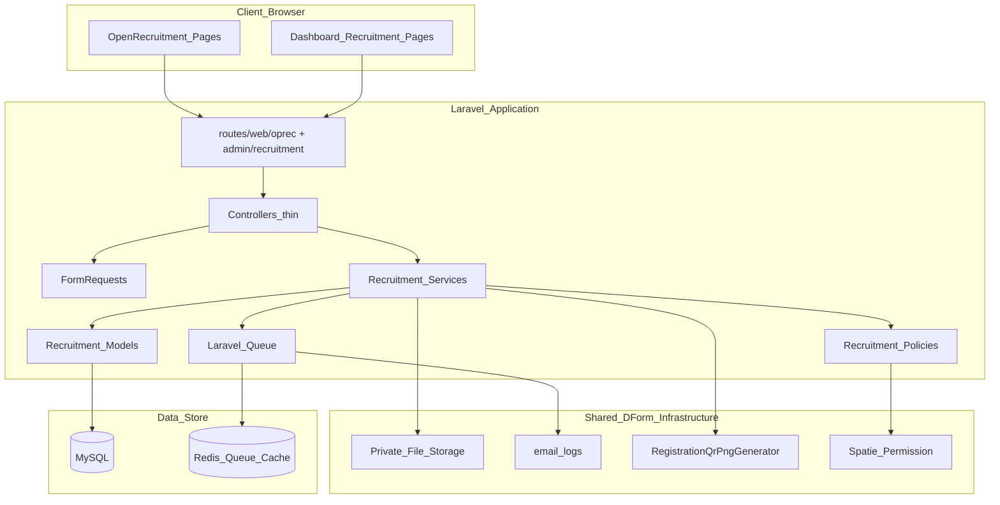
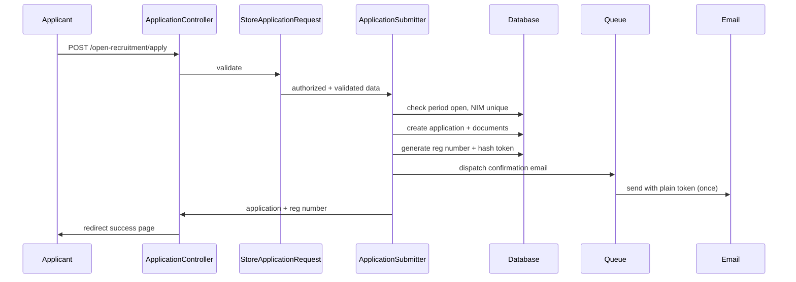

# OpRec — Arsitektur Teknis (TRD)

**Acuan:** PRD §37 (Integrasi Dynamic Form), [pedoman back-end](../../rules/back-end.md), [pedoman front-end](../../rules/front-end.md)

---

## 1. Prinsip Arsitektur

> **Dynamic Form = generic form engine; OpRec = business domain recruitment.**

OpRec **tidak** mengubah engine form event (`forms`, `form_fields`, `form_answers`) menjadi domain recruitment. OpRec memiliki:

- Tabel database domain sendiri (`recruitment_*`)
- Service layer domain sendiri (`App\Services\Recruitment\*`)
- Lifecycle & state machine sendiri

Sambil **reuse** infrastruktur platform D-Form yang sudah ada.

---

## 2. Diagram Arsitektur Tingkat Tinggi



---

## 3. Layer Backend

### 3.1 Alur Request

```text
routes/web/oprec/*.php              → Public applicant routes (no auth)
routes/web/admin/recruitment.php    → Internal dashboard (auth + permission)
    ↓
Controller (thin — alur saja)
    ↓
FormRequest (validation + authorize)
    ↓
Service (business logic)
    ↓
Model + Policy + Observer
    ↓
Queue (Mail/Notification) + ActivityLog
```

### 3.2 Namespace & Struktur Folder

| Layer | Path |
|-------|------|
| Models | `app/Models/Recruitment/` |
| Services | `app/Services/Recruitment/` |
| Controllers (public) | `app/Http/Controllers/Recruitment/` |
| Controllers (admin) | `app/Http/Controllers/Dashboard/Recruitment/` |
| Form Requests | `app/Http/Requests/Recruitment/` |
| Enums | `app/Enums/Recruitment/` |
| Policies | `app/Policies/Recruitment/` |
| Observers | `app/Observers/Recruitment/` |
| Notifications/Mail | `app/Notifications/Recruitment/` atau `app/Mail/Recruitment/` |
| Jobs | `app/Jobs/Recruitment/` |

### 3.3 Konvensi Penamaan

Mengikuti [pedoman back-end](../../rules/back-end.md):

- Controller: `RecruitmentPeriodController`, `ApplicationController`
- Request: `StoreApplicationRequest`, `ScreenApplicationRequest`
- Service: `ApplicationSubmitter`, `ScreeningService`, `QueueService`
- Route name: dot notation — `recruitment.applications.index`, `open-recruitment.apply`

---

## 4. Layer Frontend

### 4.1 Struktur Halaman

| Area | Path Vue | Layout |
|------|----------|--------|
| Public OpRec | `resources/js/pages/OpenRecruitment/*.vue` | Layout publik (bukan `DashboardLayout`) |
| Admin OpRec | `resources/js/pages/Dashboard/Recruitment/**/*.vue` | `DashboardLayout` |
| Composables | `resources/js/composables/recruitment/*.ts` | — |
| Types | `resources/js/types/recruitment.ts` | — |

### 4.2 Pola yang Diikuti (dari modul Events)

- `<script setup lang="ts">` + Composition API
- `defineOptions({ layout: DashboardLayout })` untuk halaman admin
- Wayfinder actions: `@/actions/App/Http/Controllers/Dashboard/Recruitment/...`
- URL helper: perluas `resources/js/lib/routes.ts` — **jangan hardcode path**
- UI: shadcn-vue / reka-ui + Tailwind 4

### 4.3 Routing Frontend

Inertia page names mengikuti struktur folder:

```text
OpenRecruitment/Landing.vue        → Inertia::render('OpenRecruitment/Landing')
OpenRecruitment/Apply.vue
OpenRecruitment/Track/Login.vue
OpenRecruitment/Track/Show.vue
Dashboard/Recruitment/Index.vue
Dashboard/Recruitment/Applications/Index.vue
Dashboard/Recruitment/Applications/Show.vue
...
```

---

## 5. Integrasi dengan D-Form

### 5.1 Reuse (infrastruktur platform)

| Komponen D-Form | Penggunaan OpRec | Referensi kode |
|-----------------|------------------|----------------|
| Private file storage | CV PDF, portfolio file | Pola upload Events/Forms |
| Email queue + `email_logs` | Semua notifikasi applicant/interviewer | M5 D-Form |
| `RegistrationQrPngGenerator` | QR attendance interview | `app/Services/Registration/RegistrationQrPngGenerator.php` |
| `RegistrationCodeIssuer` (adaptasi) | Format `OPREC-{YEAR}-{SEQ}` | `app/Services/Registration/RegistrationCodeIssuer.php` |
| CSV export pattern | Applicant report, funnel | Events export controllers |
| Spatie Permission | Role Staff / Interviewer / Admin | `RoleSeeder.php` |
| Organizer middleware | Gate admin recruitment | `routes/web/admin/` |
| Attendance scan UX | Staff QR scanner page | `AttendanceScanController` |

### 5.2 Tidak Reuse (MVP)

| Komponen | Alasan |
|----------|--------|
| `form_answers` / event registration | Field applicant fixed (NIM, semester, divisi, CV); lifecycle jauh lebih kompleks |
| `forms` / `form_fields` builder | OpRec form terstruktur per PRD §9–11; bukan form dinamis generic |
| Event model | OpRec multi-period independen dari event |

**Catatan future:** Integrasi Dynamic Form untuk field tambahan opsional dapat dipertimbangkan post-MVP jika organisasi membutuhkan kustomisasi form per periode.

---

## 6. Service Layer — Responsabilitas

| Service | Tanggung jawab |
|---------|----------------|
| `RecruitmentPeriodService` | CRUD period, status transition (draft→open→closed→archived), gate pendaftaran |
| `RecruitmentDivisionService` | CRUD divisi, active flag |
| `ApplicationSubmitter` | Validasi, simpan application + documents, generate reg number & tracking token, kirim email konfirmasi |
| `TrackingPresenter` | Serialize data publik untuk halaman tracking (filter field sensitif) |
| `ScreeningService` | Pass/revision/reject, reason, activity log, trigger email |
| `CorrectionRequestService` | Applicant request → staff approve/reject → edit → re-verify |
| `InterviewSchedulingService` | Session CRUD, assign interviewer by division, schedule applicant |
| `InterviewReminderService` | H-1, H-2 jam reminders dengan dedup flag |
| `AttendanceService` | Check-in QR/reg number, idempotent, timestamp |
| `QueueService` | FCFS queue number, late append, status transitions |
| `EvaluationService` | Score validation, recommendation, lock mechanism |
| `FinalSelectionService` | AA/Member/Reject, placement, public vs internal reason |
| `FeedbackService` | Submit feedback post-completed, token-scoped |
| `RecruitmentReportingQuery` | Funnel, division stats, interview averages |
| `RecruitmentActivityLogger` | Audit trail helper |

---

## 7. Keamanan Arsitektural

### 7.1 Applicant (Guest)

- **Tidak ada session auth** — akses via `registration_number` + `tracking_token`
- Token disimpan **hashed** di database (`tracking_token_hash`); plain token hanya di email konfirmasi
- Rate limiting pada `/open-recruitment/apply` dan `/open-recruitment/track`
- Enumeration protection: response generik untuk token/reg number invalid

### 7.2 File Dokumen

- CV & portfolio: **private disk** (`storage/app/recruitment/`)
- Download via authorized endpoint dengan policy check (Staff/Interviewer assigned, atau applicant via token untuk dokumen sendiri jika diizinkan)
- **Tidak** expose path langsung ke `public/storage`

### 7.3 Internal

- RBAC via Spatie Permission + Policy per model
- Principle of least privilege per role
- Activity log untuk aksi sensitif

---

## 8. Async Processing

| Proses | Mekanisme |
|--------|-----------|
| Email konfirmasi & notifikasi | Laravel Queue (Redis) |
| Interview reminder H-1 / H-2 | Scheduled command (`php artisan schedule:run`) |
| CSV export besar | Queue job (opsional post-MVP) |

Audit email via tabel `email_logs` existing (perluas nullable FK ke `recruitment_application_id` atau polymorphic jika disepakati).

---

## 9. Multi-Period Isolation

Setiap query domain **wajib** scoped ke `recruitment_period_id`:

- Applicant list, reports, dashboard KPI
- Unique constraint `(recruitment_period_id, nim)`
- Admin UI: period selector atau filter default ke period `open` / terbaru

Data period `archived` read-only untuk reporting.

---

## 10. Diagram Alur Data — Submit Application



---

## 11. Dependensi Modul D-Form

OpRec **independen** dari milestone Events/Forms (M2–M4c), tetapi bergantung pada:

| Milestone D-Form | Dependency |
|------------------|------------|
| M1 Auth & Roles | Login internal, Spatie permission infrastructure |
| M5 Email & QR | Queue worker, QR generator, email_logs |
| M6 Attendance | Referensi UX scanner (bukan data model) |

OpRec dapat dikerjakan paralel setelah auth stabil.

---

## 12. Deployment Considerations

- Queue worker harus running untuk email
- Scheduler cron untuk interview reminders
- Private storage disk configured
- Rate limit config untuk public endpoints
- Backup strategy untuk data recruitment (PRD §47)

Lihat [milestone.md](milestone.md) OpRec-M11 untuk checklist production.
