# OpRec — Database Design

**Acuan:** [domain-model.md](domain-model.md), PRD §38; [pedoman back-end](../../rules/back-end.md)

---

## 1. ERD (Logical)

```mermaid
erDiagram
  recruitment_periods ||--o{ recruitment_applications : contains
  recruitment_periods ||--o{ recruitment_interview_sessions : has
  recruitment_divisions ||--o{ recruitment_applications : primary_division
  recruitment_divisions ||--o{ recruitment_interviewer_divisions : has
  users ||--o{ recruitment_interviewer_divisions : interviewer
  recruitment_applications ||--|| recruitment_documents : has
  recruitment_applications ||--o{ recruitment_screenings : has
  recruitment_applications ||--o{ recruitment_correction_requests : has
  recruitment_applications ||--o| recruitment_interviews : has
  recruitment_applications ||--o| recruitment_attendances : has
  recruitment_applications ||--o| recruitment_queue_entries : has
  recruitment_applications ||--o| recruitment_evaluations : has
  recruitment_applications ||--o| recruitment_final_decisions : has
  recruitment_applications ||--o| recruitment_feedbacks : has
  recruitment_applications ||--o{ recruitment_activity_logs : has
  recruitment_interview_sessions ||--o{ recruitment_interviews : schedules
  recruitment_interviews }o--|| users : interviewer
  recruitment_final_decisions }o--o| recruitment_divisions : final_division
```

---

## 2. Konvensi

- Primary key: **UUID** (`uuid()`), konsisten dengan model D-Form existing
- Timestamps: `created_at`, `updated_at` pada semua tabel
- Soft delete: pada `recruitment_periods`, `recruitment_divisions` (opsional `recruitment_applications` untuk audit)
- Foreign keys: `foreignUuid()` dengan `cascadeOnDelete` atau `nullOnDelete` sesuai kebutuhan audit
- Enum columns: `string` + backed enum casting di Model

---

## 3. Tabel: `recruitment_periods`

| Kolom | Tipe | Constraint | Deskripsi |
|-------|------|------------|-----------|
| `id` | uuid | PK | |
| `name` | string(100) | NOT NULL | Contoh: "OpRec 2026" |
| `slug` | string(100) | UNIQUE | Contoh: "oprec-2026" |
| `status` | string(20) | NOT NULL, default `draft` | draft/open/closed/archived |
| `description` | text | nullable | Info program |
| `registration_opens_at` | datetime | nullable | Buka pendaftaran |
| `registration_closes_at` | datetime | nullable | Tutup pendaftaran |
| `interview_starts_at` | date | nullable | Awal periode interview |
| `interview_ends_at` | date | nullable | Akhir periode interview |
| `finalization_deadline_at` | date | nullable | Target selesai final selection |
| `landing_content` | json | nullable | Hero, timeline, requirements (CMS-lite) |
| `created_at` | timestamp | | |
| `updated_at` | timestamp | | |
| `deleted_at` | timestamp | nullable | Soft delete |

**Index:** `(status)`, `(registration_opens_at, registration_closes_at)`

---

## 4. Tabel: `recruitment_divisions`

Divisi global (reuse antar period) atau per-period — **keputusan: global dengan seed default**, filter active.

| Kolom | Tipe | Constraint | Deskripsi |
|-------|------|------------|-----------|
| `id` | uuid | PK | |
| `code` | string(30) | UNIQUE | programming, medcrev, network, data |
| `name` | string(100) | NOT NULL | Display name |
| `description` | text | nullable | |
| `is_active` | boolean | default true | |
| `sort_order` | smallint | default 0 | Urutan tampilan |
| `created_at` | timestamp | | |
| `updated_at` | timestamp | | |
| `deleted_at` | timestamp | nullable | |

**Seed default (OpRec-M1):**

| code | name |
|------|------|
| `programming` | Pemrograman / Programming |
| `medcrev` | Creative Media / Medcrev |
| `network` | Jaringan / Network |
| `data` | Data |

---

## 5. Tabel: `recruitment_interviewer_divisions`

Pivot: interviewer (user) ↔ division.

| Kolom | Tipe | Constraint |
|-------|------|------------|
| `id` | uuid | PK |
| `user_id` | uuid | FK → users, NOT NULL |
| `recruitment_division_id` | uuid | FK → recruitment_divisions, NOT NULL |
| `created_at` | timestamp | |
| `updated_at` | timestamp | |

**Unique:** `(user_id, recruitment_division_id)`

---

## 6. Tabel: `recruitment_applications`

| Kolom | Tipe | Constraint | Deskripsi |
|-------|------|------------|-----------|
| `id` | uuid | PK | |
| `recruitment_period_id` | uuid | FK, NOT NULL | |
| `registration_number` | string(30) | UNIQUE, NOT NULL | OPREC-2026-00123 |
| `tracking_token_hash` | string(255) | NOT NULL | bcrypt/argon hash |
| `full_name` | string(255) | NOT NULL | |
| `nim` | string(50) | NOT NULL | |
| `semester` | tinyint unsigned | NOT NULL | 1–3 |
| `phone` | string(30) | NOT NULL | |
| `personal_email` | string(255) | NOT NULL | |
| `student_email` | string(255) | NOT NULL | |
| `instagram_username` | string(100) | NOT NULL | |
| `primary_division_id` | uuid | FK, NOT NULL | |
| `secondary_division_id` | uuid | FK, nullable | |
| `stage` | string(30) | NOT NULL, default `submitted` | |
| `result` | string(20) | NOT NULL, default `pending` | |
| `is_verified` | boolean | default false | Locked setelah verified |
| `revision_required` | boolean | default false | |
| `submitted_at` | datetime | NOT NULL | |
| `verified_at` | datetime | nullable | |
| `verified_by` | uuid | FK → users, nullable | |
| `cancelled_at` | datetime | nullable | |
| `cancelled_by` | uuid | FK → users, nullable | Applicant cancel = null actor |
| `created_at` | timestamp | | |
| `updated_at` | timestamp | | |

**Unique:** `(recruitment_period_id, nim)`

**Index:**

- `(recruitment_period_id, stage)`
- `(recruitment_period_id, result)`
- `(recruitment_period_id, primary_division_id)`
- `(registration_number)` — covered by UNIQUE

---

## 7. Tabel: `recruitment_documents`

| Kolom | Tipe | Constraint |
|-------|------|------------|
| `id` | uuid | PK |
| `recruitment_application_id` | uuid | FK, UNIQUE |
| `cv_path` | string(500) | NOT NULL |
| `cv_original_name` | string(255) | NOT NULL |
| `cv_mime` | string(100) | NOT NULL |
| `cv_size_bytes` | unsigned int | NOT NULL |
| `portfolio_type` | string(10) | NOT NULL | url \| file |
| `portfolio_url` | string(500) | nullable |
| `portfolio_path` | string(500) | nullable |
| `portfolio_original_name` | string(255) | nullable |
| `portfolio_mime` | string(100) | nullable |
| `portfolio_size_bytes` | unsigned int | nullable |
| `created_at` | timestamp | |
| `updated_at` | timestamp | |

---

## 8. Tabel: `recruitment_screenings`

History screening (many rows per application).

| Kolom | Tipe | Constraint |
|-------|------|------------|
| `id` | uuid | PK |
| `recruitment_application_id` | uuid | FK, NOT NULL |
| `decision` | string(30) | NOT NULL |
| `reason` | string(50) | nullable |
| `notes` | text | nullable |
| `acted_by` | uuid | FK → users, NOT NULL |
| `acted_at` | datetime | NOT NULL |
| `created_at` | timestamp | |

**Index:** `(recruitment_application_id, acted_at)`

---

## 9. Tabel: `recruitment_correction_requests`

| Kolom | Tipe | Constraint |
|-------|------|------------|
| `id` | uuid | PK |
| `recruitment_application_id` | uuid | FK, NOT NULL |
| `status` | string(20) | NOT NULL, default `pending` |
| `request_message` | text | NOT NULL |
| `review_notes` | text | nullable |
| `reviewed_by` | uuid | FK → users, nullable |
| `reviewed_at` | datetime | nullable |
| `completed_at` | datetime | nullable |
| `created_at` | timestamp | |
| `updated_at` | timestamp | |

---

## 10. Tabel: `recruitment_interview_sessions`

| Kolom | Tipe | Constraint |
|-------|------|------------|
| `id` | uuid | PK |
| `recruitment_period_id` | uuid | FK, NOT NULL |
| `recruitment_division_id` | uuid | FK, NOT NULL |
| `session_date` | date | NOT NULL |
| `starts_at` | time | NOT NULL |
| `ends_at` | time | NOT NULL |
| `location` | string(255) | NOT NULL |
| `room` | string(100) | NOT NULL |
| `notes` | text | nullable |
| `is_active` | boolean | default true |
| `created_at` | timestamp | |
| `updated_at` | timestamp | |

**Index:** `(recruitment_period_id, session_date)`, `(recruitment_division_id, session_date)`

---

## 11. Tabel: `recruitment_interviews`

| Kolom | Tipe | Constraint |
|-------|------|------------|
| `id` | uuid | PK |
| `recruitment_application_id` | uuid | FK, UNIQUE |
| `recruitment_interview_session_id` | uuid | FK, NOT NULL |
| `interviewer_id` | uuid | FK → users, NOT NULL |
| `scheduled_at` | datetime | NOT NULL |
| `location` | string(255) | NOT NULL |
| `room` | string(100) | NOT NULL |
| `status` | string(30) | NOT NULL, default `scheduled` |
| `reminder_h1_sent_at` | datetime | nullable |
| `reminder_h2_sent_at` | datetime | nullable |
| `created_at` | timestamp | |
| `updated_at` | timestamp | |

**Index:** `(interviewer_id, scheduled_at)`, `(recruitment_interview_session_id, status)`

---

## 12. Tabel: `recruitment_attendances`

| Kolom | Tipe | Constraint |
|-------|------|------------|
| `id` | uuid | PK |
| `recruitment_application_id` | uuid | FK, UNIQUE |
| `recruitment_interview_session_id` | uuid | FK, NOT NULL |
| `method` | string(20) | NOT NULL | qr \| registration_number |
| `checked_in_at` | datetime | NOT NULL |
| `checked_in_by` | uuid | FK → users, nullable | null jika self check-in |
| `created_at` | timestamp | |

**Index:** `(recruitment_interview_session_id, checked_in_at)` — untuk FCFS ordering

---

## 13. Tabel: `recruitment_queue_entries`

| Kolom | Tipe | Constraint |
|-------|------|------------|
| `id` | uuid | PK |
| `recruitment_application_id` | uuid | FK, UNIQUE |
| `recruitment_interview_session_id` | uuid | FK, NOT NULL |
| `queue_number` | unsigned int | NOT NULL |
| `status` | string(20) | NOT NULL, default `waiting` |
| `called_at` | datetime | nullable |
| `completed_at` | datetime | nullable |
| `created_at` | timestamp | |
| `updated_at` | timestamp | |

**Unique:** `(recruitment_interview_session_id, queue_number)`

**Index:** `(recruitment_interview_session_id, status, queue_number)`

---

## 14. Tabel: `recruitment_evaluations`

| Kolom | Tipe | Constraint |
|-------|------|------------|
| `id` | uuid | PK |
| `recruitment_application_id` | uuid | FK, UNIQUE |
| `recruitment_interview_id` | uuid | FK, NOT NULL |
| `speaking_score` | tinyint unsigned | NOT NULL | 1–10 |
| `technical_score` | tinyint unsigned | NOT NULL | 1–10 |
| `attitude_score` | tinyint unsigned | NOT NULL | 1–10 |
| `recommendation` | string(20) | NOT NULL |
| `notes` | text | nullable |
| `evaluated_by` | uuid | FK → users, NOT NULL |
| `evaluated_at` | datetime | NOT NULL |
| `locked_at` | datetime | nullable |
| `created_at` | timestamp | |
| `updated_at` | timestamp | |

---

## 15. Tabel: `recruitment_final_decisions`

| Kolom | Tipe | Constraint |
|-------|------|------------|
| `id` | uuid | PK |
| `recruitment_application_id` | uuid | FK, UNIQUE |
| `membership_type` | string(10) | nullable | aa \| member |
| `final_division_id` | uuid | FK → recruitment_divisions, nullable |
| `internal_reason` | text | nullable |
| `public_message` | text | nullable |
| `decided_by` | uuid | FK → users, NOT NULL |
| `decided_at` | datetime | NOT NULL |
| `created_at` | timestamp | |
| `updated_at` | timestamp | |

---

## 16. Tabel: `recruitment_feedbacks`

| Kolom | Tipe | Constraint |
|-------|------|------------|
| `id` | uuid | PK |
| `recruitment_application_id` | uuid | FK, UNIQUE |
| `recruitment_period_id` | uuid | FK, NOT NULL |
| `rating_registration_ease` | tinyint | NOT NULL | 1–5 |
| `rating_info_clarity` | tinyint | NOT NULL | 1–5 |
| `rating_tracking_ease` | tinyint | NOT NULL | 1–5 |
| `rating_interview_experience` | tinyint | NOT NULL | 1–5 |
| `rating_staff_service` | tinyint | NOT NULL | 1–5 |
| `feedback_text` | text | nullable |
| `submitted_at` | datetime | NOT NULL |
| `created_at` | timestamp | |

---

## 17. Tabel: `recruitment_activity_logs`

| Kolom | Tipe | Constraint |
|-------|------|------------|
| `id` | uuid | PK |
| `recruitment_application_id` | uuid | FK, nullable |
| `recruitment_period_id` | uuid | FK, nullable |
| `actor_id` | uuid | FK → users, nullable |
| `actor_type` | string(20) | NOT NULL | user \| applicant \| system |
| `action` | string(100) | NOT NULL |
| `entity_type` | string(100) | nullable |
| `entity_id` | uuid | nullable |
| `old_values` | json | nullable |
| `new_values` | json | nullable |
| `ip_address` | string(45) | nullable |
| `created_at` | timestamp | NOT NULL |

**Index:** `(recruitment_application_id, created_at)`, `(recruitment_period_id, created_at)`, `(action)`

---

## 18. Tabel: `recruitment_email_templates`

| Kolom | Tipe | Constraint |
|-------|------|------------|
| `id` | uuid | PK |
| `event_type` | string(50) | UNIQUE, NOT NULL | application_submitted, dll. |
| `subject` | string(255) | NOT NULL |
| `body_html` | text | NOT NULL |
| `body_text` | text | nullable |
| `available_variables` | json | nullable |
| `is_active` | boolean | default true |
| `created_at` | timestamp | |
| `updated_at` | timestamp | |

---

## 19. Tabel: `recruitment_registration_sequences`

Helper untuk generate nomor urut per period/year (avoid race condition).

| Kolom | Tipe | Constraint |
|-------|------|------------|
| `id` | uuid | PK |
| `recruitment_period_id` | uuid | FK, UNIQUE |
| `last_sequence` | unsigned int | NOT NULL, default 0 |
| `updated_at` | timestamp | |

Generate: `OPREC-{year}-{last_sequence padded 5 digits}` dalam transaction dengan row lock.

---

## 20. Perluasan `email_logs` (Opsional)

Tambah kolom nullable pada tabel existing:

| Kolom | Tipe | Deskripsi |
|-------|------|-----------|
| `recruitment_application_id` | uuid | FK nullable |

Atau gunakan polymorphic `notifiable_type` / `notifiable_id` — **disepakati di OpRec-M2**.

---

## 21. Migration Strategy

### OpRec-M1 (Foundation)

Satu migration file per logical group (disarankan 2–3 file):

1. `create_recruitment_periods_table` + `recruitment_divisions` + `recruitment_interviewer_divisions` + `recruitment_registration_sequences`
2. `create_recruitment_applications_table` + `recruitment_documents` + `recruitment_screenings` + `recruitment_correction_requests`
3. `create_recruitment_interview_sessions_table` + interviews + attendances + queue + evaluations + final_decisions + feedbacks + activity_logs + email_templates

Atau satu migration besar untuk MVP simplicity — pilih sesuai preferensi tim (back-end rules: weak entity boleh digabung).

### Seeders

- `RecruitmentDivisionSeeder` — 4 divisi default
- `RecruitmentEmailTemplateSeeder` — template default per event type
- `RecruitmentPeriodSeeder` — hanya non-production (OpRec 2026 dummy)

---

## 22. Query Patterns

| Use Case | Query |
|----------|-------|
| Dashboard KPI | `COUNT(*) GROUP BY stage` WHERE period_id = ? |
| Applicant list | Paginate + filter stage, division, semester, search NIM/name |
| FCFS queue | `ORDER BY checked_in_at ASC` join attendances |
| Funnel report | Aggregate counts per stage transition |
| Interviewer today | `WHERE interviewer_id = ? AND DATE(scheduled_at) = today` |

Semua list endpoints **wajib pagination** (NFR PRD §36).

---

## 23. Retention & Archive

Kebijakan retention final ditentukan PO (PRD §48). Implementasi teknis:

- Period `archived`: block write kecuali admin export
- Soft delete application: optional; prefer archive over hard delete
- File documents: retain selama period archived; cleanup manual/cron (post-MVP)
