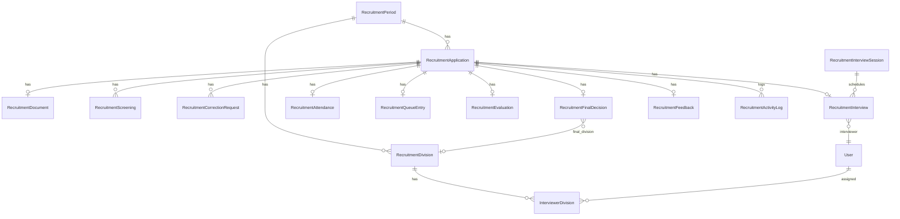
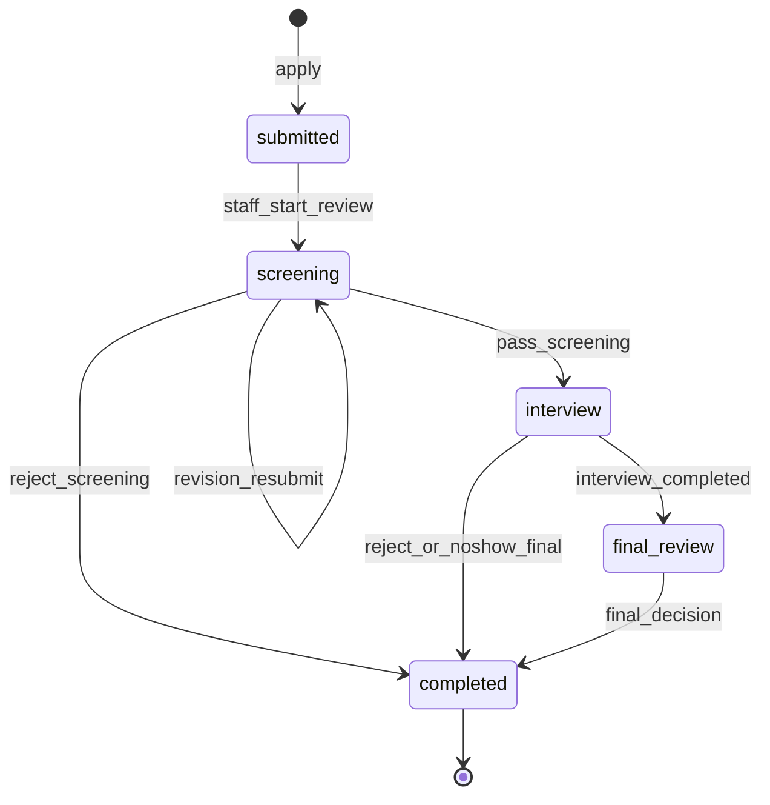

# OpRec — Domain Model

**Acuan:** PRD §13, §39, §38; [database-design.md](database-design.md)

---

## 1. Entity Relationship (Konseptual)



---

## 2. Aggregate Roots

| Aggregate | Root Entity | Child Entities |
|-----------|-------------|----------------|
| Period | `RecruitmentPeriod` | Divisions (config per period atau global — lihat DB design) |
| Application | `RecruitmentApplication` | Document, Screenings, CorrectionRequests, Interview, Attendance, QueueEntry, Evaluation, FinalDecision, Feedback, ActivityLogs |
| Interview Session | `RecruitmentInterviewSession` | Interviews (assignments) |
| Email Template | `RecruitmentEmailTemplate` | — |

---

## 3. Enums (Backed String)

Semua enum di `App\Enums\Recruitment\`, dengan casting di Model.

### 3.1 RecruitmentPeriodStatus

| Case | Label | Deskripsi |
|------|-------|-----------|
| `draft` | Draft | Period dibuat, belum publik |
| `open` | Open | Pendaftaran applicant aktif |
| `closed` | Closed | Pendaftaran tutup; proses internal boleh lanjut |
| `archived` | Archived | Period selesai; read-only reporting |

### 3.2 ApplicationStage

| Case | Deskripsi |
|------|-----------|
| `submitted` | Baru submit, menunggu screening |
| `screening` | Sedang/telah masuk tahap screening |
| `interview` | Lolos screening; tahap interview |
| `final_review` | Interview selesai; menunggu keputusan Staff |
| `completed` | Final decision ditetapkan |

### 3.3 ApplicationResult

| Case | Deskripsi |
|------|-----------|
| `pending` | Belum ada keputusan final |
| `accepted` | Diterima (AA atau Member) |
| `rejected` | Ditolak |
| `cancelled` | Dibatalkan applicant atau staff |

### 3.4 ScreeningDecision

| Case | Deskripsi |
|------|-----------|
| `pass` | Lolos ke interview |
| `revision_required` | Applicant harus perbaiki data/dokumen |
| `reject` | Tidak lanjut recruitment |

### 3.5 ScreeningReason (preset)

| Case | Deskripsi |
|------|-----------|
| `incomplete_data` | Data tidak lengkap |
| `invalid_data` | Data tidak valid |
| `document_mismatch` | Dokumen tidak sesuai |
| `document_unreadable` | Dokumen tidak dapat dibaca |
| `info_mismatch` | Informasi tidak sesuai |
| `requirements_not_met` | Persyaratan tidak terpenuhi |
| `other` | Lainnya (wajib notes) |

### 3.6 InterviewStatus

| Case | Deskripsi |
|------|-----------|
| `not_scheduled` | Belum dijadwalkan |
| `scheduled` | Jadwal ditetapkan |
| `checked_in` | Attendance tercatat |
| `queued` | Memiliki nomor antrean |
| `called` | Dipanggil untuk interview |
| `in_progress` | Sedang diinterview |
| `completed` | Interview selesai |
| `no_show` | Tidak hadir |

### 3.7 QueueStatus

| Case | Deskripsi |
|------|-----------|
| `waiting` | Menunggu dipanggil |
| `called` | Sudah dipanggil |
| `in_progress` | Sedang interview |
| `completed` | Selesai |

### 3.8 MembershipType

| Case | Deskripsi |
|------|-----------|
| `aa` | Accepted as AA |
| `member` | Accepted as Member |

### 3.9 EvaluationRecommendation

| Case | Deskripsi |
|------|-----------|
| `recommended` | Recommended |
| `not_recommended` | Not Recommended |

### 3.10 PortfolioType

| Case | Deskripsi |
|------|-----------|
| `url` | Portfolio berupa URL |
| `file` | Portfolio berupa file PDF |

### 3.11 AttendanceMethod

| Case | Deskripsi |
|------|-----------|
| `qr` | Check-in via QR scan |
| `registration_number` | Check-in via input nomor pendaftaran |

### 3.12 CorrectionRequestStatus

| Case | Deskripsi |
|------|-----------|
| `pending` | Menunggu review staff |
| `approved` | Staff setuju; applicant boleh edit |
| `rejected` | Staff tolak permintaan |
| `completed` | Applicant selesai submit koreksi |

---

## 4. State Machine — Application

### 4.1 Stage Transitions



### 4.2 Detailed Status Flow (PRD §39)

```text
SUBMITTED
    │
    ▼
SCREENING
    │
    ├── REVISION_REQUIRED ──→ (applicant edit) ──→ SCREENING
    │
    ├── REJECTED ──→ COMPLETED (result: rejected)
    │
    └── PASSED
             │
             ▼
       INTERVIEW_SCHEDULED
             │
             ▼
       WAITING_ATTENDANCE
             │
             ▼
           QUEUED
             │
             ▼
         INTERVIEWING
             │
             ▼
         INTERVIEWED
             │
             ▼
         FINAL_REVIEW
             │
        ┌────┴─────┐
        ▼          ▼
    ACCEPTED     REJECTED
        │
        ├── Membership: AA / Member
        └── Final Division
```

### 4.3 Valid Transitions (Service Layer Enforcement)

| From | Action | To | Actor |
|------|--------|-----|-------|
| — | submit | `submitted` | Applicant |
| `submitted` | start screening | `screening` | Staff |
| `screening` | pass | `interview` | Staff |
| `screening` | revision required | `screening` (flag revision) | Staff |
| `screening` | reject | `completed` + result rejected | Staff |
| `interview` | all interviews done | `final_review` | System/Staff |
| `final_review` | accept AA/Member | `completed` + result accepted | Staff |
| `final_review` | reject | `completed` + result rejected | Staff |
| any (pre-final) | cancel | `completed` + result cancelled | Applicant/Staff |

Invalid transitions **must throw** domain exception; jangan rely on UI saja.

---

## 5. Entity Detail

### 5.1 RecruitmentApplication (core)

Atribut utama:

| Atribut | Tipe | Catatan |
|---------|------|---------|
| `id` | UUID | PK |
| `recruitment_period_id` | UUID | FK |
| `registration_number` | string | Unique globally, format `OPREC-{YEAR}-{SEQ}` |
| `tracking_token_hash` | string | Hash token; plain tidak disimpan |
| `full_name` | string | |
| `nim` | string | Unique per period |
| `semester` | tinyint | 1–3 |
| `phone` | string | |
| `personal_email` | string | |
| `student_email` | string | |
| `instagram_username` | string | |
| `primary_division_id` | UUID | FK |
| `secondary_division_id` | UUID | FK nullable |
| `stage` | ApplicationStage | |
| `result` | ApplicationResult | |
| `is_verified` | boolean | Staff tandai verified → form locked |
| `revision_required` | boolean | Flag sedang menunggu revisi applicant |
| `cancelled_at` | datetime | nullable |
| `submitted_at` | datetime | |

### 5.2 RecruitmentDocument

| Atribut | Catatan |
|---------|---------|
| `cv_path` | Private storage path |
| `cv_original_name` | Nama file asli |
| `cv_mime` | application/pdf |
| `portfolio_type` | url \| file |
| `portfolio_url` | nullable |
| `portfolio_path` | nullable |
| `portfolio_original_name` | nullable |

### 5.3 RecruitmentScreening (history — many per application)

Setiap keputusan screening = baris baru (audit trail).

| Atribut | Catatan |
|---------|---------|
| `decision` | pass \| revision_required \| reject |
| `reason` | ScreeningReason enum |
| `notes` | text nullable |
| `acted_by` | user_id FK |
| `acted_at` | datetime |

### 5.4 RecruitmentInterview

| Atribut | Catatan |
|---------|---------|
| `interview_session_id` | FK |
| `interviewer_id` | user_id FK |
| `scheduled_at` | datetime |
| `location` | string |
| `room` | string |
| `status` | InterviewStatus |
| `reminder_h1_sent_at` | nullable |
| `reminder_h2_sent_at` | nullable |

### 5.5 RecruitmentEvaluation

| Atribut | Catatan |
|---------|---------|
| `speaking_score` | 1–10 |
| `technical_score` | 1–10 |
| `attitude_score` | 1–10 |
| `recommendation` | recommended \| not_recommended |
| `notes` | text nullable |
| `evaluated_by` | user_id |
| `locked_at` | nullable — set when next applicant called |

### 5.6 RecruitmentFinalDecision

| Atribut | Catatan |
|---------|---------|
| `membership_type` | aa \| member \| null (if rejected) |
| `final_division_id` | FK nullable |
| `internal_reason` | text — staff only |
| `public_message` | text — shown to applicant |
| `decided_by` | user_id |
| `decided_at` | datetime |

---

## 6. Business Rules (Domain Layer)

Rules ini **wajib** di-enforce di Service layer, bukan hanya UI:

1. **Unique NIM per period** — reject duplicate at submit
2. **Semester 1–3** — validation
3. **Secondary ≠ primary division**
4. **Period must be `open`** — untuk submit baru
5. **Revision/Reject requires reason** — screening service
6. **Interviewer assignment by primary division** — scheduling service
7. **One interviewer per application** — constraint
8. **Scores 1–10 integer** — evaluation service
9. **No weighted score** — display only, no auto-decision
10. **Attendance before queue** — queue service rejects without attendance
11. **FCFS queue** — ordered by `checked_in_at`
12. **Late → append tail** — queue service
13. **Final division required if accepted** — final selection service
14. **Rejection reason required if rejected** — final selection service
15. **Evaluation locked** — no edit by interviewer after lock (staff override with audit)
16. **Tracking exposes public fields only** — tracking presenter whitelist
17. **Cancel blocks re-apply** — unless staff reopen (see [decisions.md](decisions.md))

---

## 7. Domain Events (Opsional — untuk Observer/Listener)

| Event | Trigger | Side Effects |
|-------|---------|--------------|
| `ApplicationSubmitted` | Submit success | Email confirmation, activity log |
| `ScreeningDecisionMade` | Pass/revision/reject | Email, stage update, activity log |
| `InterviewScheduled` | Schedule created | Email schedule |
| `AttendanceRecorded` | Check-in | Queue number, status update |
| `EvaluationSubmitted` | Interviewer save | Activity log |
| `FinalDecisionMade` | Staff decision | Email result, stage completed |
| `FeedbackSubmitted` | Applicant feedback | — |

Implementasi MVP: Observer pada Model atau explicit call di Service (prefer explicit di Service untuk clarity).

---

## 8. Value Objects (Konseptual)

| Value Object | Validasi |
|--------------|----------|
| `RegistrationNumber` | Pattern `OPREC-\d{4}-\d{5}` |
| `Nim` | Format sesuai kebijakan kampus (TBD — validasi dasar: non-empty, unique) |
| `Semester` | Integer 1–3 |
| `InterviewScore` | Integer 1–10 |
| `TrackingCredential` | Reg number + token pair |

---

## 9. Referensi ke PRD

| Topik PRD | Section |
|-----------|---------|
| Application stages | §13.1 |
| Interview status | §13.3 |
| Status transition diagram | §39 |
| Edge cases | §40 |
| Product rules (28) | §51 |
