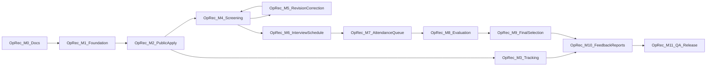

# Milestone — DOSCOM OpenRecruitment (OpRec)

**Tujuan dokumen:** memberi tahapan kerja yang jelas untuk development modul OpRec end-to-end, dengan dependensi terbaca dan kriteria selesai yang verifiable.

**Acuan produk:** [PRD — DOSCOM OpenRecruitment (OpRec)](../PRD%20—%20DOSCOM%20OpenRecruitment%20(OpRec).md)  
**Acuan teknis:** [README](README.md), [architecture.md](architecture.md), [database-design.md](database-design.md), [pedoman front-end](../../rules/front-end.md), [pedoman back-end](../../rules/back-end.md)  
**Relasi D-Form:** Modul independen dari [milestone D-Form v2](../../milestone.md) (M0–M8), reuse infrastruktur M1/M5/M6.

---

## Diagram dependensi antar fase

- **M2 → M4:** screening membutuhkan application data dari submit flow.
- **M4 → M6 dan M4 → M5:** setelah screening pass, interview scheduling parallel track dengan revision flow (M5 loop back ke M4).
- **M3 → M10:** tracking UI dapat dipoles paralel dengan reporting; feedback butuh tracking auth.
- **Critical path:** M1 → M2 → M4 → M6 → M7 → M8 → M9 → M11

---

## Estimasi timeline

| Skenario | Durasi M0–M11 | Buffer UAT |
|----------|---------------|------------|
| 1 dev fullstack | ~12–14 minggu | +1–2 minggu |
| 2 dev paralel | ~8–10 minggu | +1 minggu |

---

## OpRec-M0 — Dokumentasi & Keputusan Arsitektur

| | |
|---|---|
| **Tujuan** | Baseline teknis sebelum coding; stakeholder sign-off open questions |
| **Owner (saran)** | Tech lead + PM + PO |
| **Deliverable** | Folder `docs/module/oprec/*` lengkap; [decisions.md](decisions.md) dengan rekomendasi default; sign-off checklist |
| **Kriteria selesai** | Tech lead approve architecture; PO approve scope MVP; tidak ada open question BLOCKER untuk M1 |
| **Estimasi** | 3–5 hari |
| **Paralelisasi** | Spike draft migration di akhir M0 (opsional) |
| **Smoke test** | Tim dapat menjelaskan alur Apply → Final tanpa ambiguity |

**FR/NFR covered:** Foundation untuk semua FR-01–FR-14

**Checklist PRD §52 (partial):** Dokumentasi operasional modul tersedia

---

## OpRec-M1 — Foundation: Database, Model, Permission, Period Admin

| | |
|---|---|
| **Tujuan** | Domain layer + admin dapat mengelola periode & divisi |
| **Owner (saran)** | Fullstack |
| **Dependensi** | M0 selesai |
| **Estimasi** | 1–1.5 minggu |

### Deliverable Backend

- Migrasi semua tabel core (lihat [database-design.md](database-design.md))
- Models `App\Models\Recruitment\*` + Enums + Factories
- Seeders: `RecruitmentDivisionSeeder` (4 divisi), `RecruitmentEmailTemplateSeeder` (skeleton)
- Uncomment & extend permission `recruitment.*` di `RoleSeeder`
- Roles baru: `recruitment-staff`, `recruitment-interviewer`
- Policies skeleton
- Services: `RecruitmentPeriodService`, `RecruitmentDivisionService`
- Routes admin: periods CRUD, divisions, interviewer assignment

### Deliverable Frontend

- Ganti placeholder [`Index.vue`](../../../resources/js/pages/Dashboard/Recruitment/Index.vue) → dashboard skeleton dengan KPI placeholder
- CRUD Period: `/admin/recruitment/periods`
- CRUD Division + assign interviewer ↔ division
- Sidebar sub-menu Rekrutmen (permission-gated)
- Perluas `resources/js/lib/routes.ts`

### Smoke test

Admin buat period `OpRec 2026` status draft → open; 4 divisi aktif; interviewer ter-assign ke Programming.

### Kriteria selesai

- [ ] `php artisan migrate:fresh --seed` lolos
- [ ] Permission test: member tidak akses `/admin/recruitment`
- [ ] Admin dapat open/close period
- [ ] 4 divisi default ter-seed

---

## OpRec-M2 — Public Landing & Application Submission

| | |
|---|---|
| **Tujuan** | Applicant guest dapat mendaftar end-to-end tanpa login |
| **Owner (saran)** | Fullstack |
| **Dependensi** | M1 (period open) |
| **Estimasi** | 1–1.5 minggu |

### Deliverable Backend

- Routes public (`routes/web/oprec.php`)
- `StoreApplicationRequest`: NIM unique, semester 1–3, division rules, CV PDF, portfolio url/file
- `ApplicationSubmitter` service
- Generate `OPREC-{YEAR}-{SEQ}` + tracking token (hash stored)
- Private file storage untuk CV/portfolio
- Confirmation email via queue
- Gate: period `open`, within registration window
- Rate limit `throttle:oprec-apply`
- Perluas `email_logs` dengan `recruitment_application_id` (nullable FK)

### Deliverable Frontend

- Landing `/open-recruitment` (info, timeline, CTA aktif jika period open)
- Application form (single page atau multi-step)
- Success page dengan reg number (token via email, tidak di URL)
- Layout public `OpenRecruitment/*`

### Smoke test

Submit valid → reg number + email queued; duplicate NIM ditolak; submit saat closed ditolak.

### Kriteria selesai

- [ ] FR-01 Landing page
- [ ] FR-02 Application form validation
- [ ] FR-03 Registration number + confirmation email (partial — tracking di M3)
- [ ] CV private storage verified
- [ ] Feature tests F-01–F-10 green

**Reuse:** upload pattern Events/Forms, email queue M5, `RegistrationCodeIssuer` pattern

---

## OpRec-M3 — Applicant Tracking (Guest Portal)

| | |
|---|---|
| **Tujuan** | Applicant melihat progress tanpa login, dengan aman |
| **Owner (saran)** | Fullstack |
| **Dependensi** | M2 |
| **Estimasi** | 4–6 hari |

### Deliverable Backend

- Tracking auth: reg number + token → session (lihat [decisions.md](decisions.md) Decision 06)
- `TrackingPresenter` — whitelist field publik only
- Rate limiting `throttle:oprec-track`
- Middleware `EnsureTrackingSession`

### Deliverable Frontend

- `/open-recruitment/track` — login form
- `/open-recruitment/track/dashboard` — timeline visual per stage
- Tampilan interview schedule & final result (jika ada)

### Smoke test

Token valid → lihat status; token/reg invalid → ditolak generik; tidak bisa lihat applicant lain.

### Kriteria selesai

- [ ] FR-13 Applicant tracking
- [ ] PRD §14.1 — no internal data exposed
- [ ] Feature tests F-11–F-15 green

**Paralelisasi:** UI timeline mock data paralel M2 backend

---

## OpRec-M4 — Staff Applicant Management & Screening

| | |
|---|---|
| **Tujuan** | Staff memproses applicant: list, detail, screening decision |
| **Owner (saran)** | Fullstack |
| **Dependensi** | M2 |
| **Estimasi** | 1 minggu |

### Deliverable Backend

- Application list: pagination, filter division/stage/semester/search
- Detail view + authorized document download
- `ScreeningService`: pass / revision_required / reject + reason wajib
- Activity log setiap decision
- Emails: revision required, passed screening, rejected screening

### Deliverable Frontend

- Applications table + filters
- Application Show: tabs (overview, documents, screening, history)
- Screening action modal dengan reason picker

### Smoke test

Submit → Staff pass → stage berubah + email queued; reject tanpa reason → validation error.

### Kriteria selesai

- [ ] FR-04 Screening
- [ ] Dashboard KPI: total, pending screening, passed, rejected
- [ ] Feature tests F-16–F-21, P-03 green

---

## OpRec-M5 — Revision, Editing & Correction Request

| | |
|---|---|
| **Tujuan** | Applicant memperbaiki data; post-lock correction workflow |
| **Owner (saran)** | Fullstack |
| **Dependensi** | M3, M4 |
| **Estimasi** | 1 minggu |

### Deliverable Backend

- Pre-verify edit: editable until `is_verified = true`
- Revision flow: applicant edit → re-screening
- `CorrectionRequestService`: request → staff approve/reject → edit → re-verify
- Semua perubahan di activity log
- Email staff on correction request

### Deliverable Frontend

- Edit form di tracking (saat revision_required atau correction approved)
- Correction request UI di tracking
- Staff correction review panel di application show

### Smoke test

Submit → Revision → applicant edit → re-screen → Pass.

### Kriteria selesai

- [ ] FR-05 Correction workflow
- [ ] PRD §15–16
- [ ] Feature tests F-22–F-26 green

---

## OpRec-M6 — Interview Scheduling, Assignment & Reminders

| | |
|---|---|
| **Tujuan** | Staff menjadwalkan interview; interviewer by division; reminder otomatis |
| **Owner (saran)** | Fullstack |
| **Dependensi** | M4 (applicant passed) |
| **Estimasi** | 1–1.5 minggu |

### Deliverable Backend

- `RecruitmentInterviewSession` CRUD
- Auto/manual assign interviewer by primary division
- Schedule passed applicants ke session
- Emails: interview scheduled, interviewer assignment
- Command `recruitment:send-interview-reminders` (H-1, H-2 jam, dedup)
- Staff reschedule & reassign

### Deliverable Frontend

- Interview session management
- Bulk schedule UI
- Interviewer assignment admin (extend M1)

### Smoke test

Passed applicant → scheduled → email queued; reminder command test dengan `Carbon::setTestNow()`.

### Kriteria selesai

- [ ] FR-06 Interview scheduling
- [ ] FR-07 Reminders dengan dedup
- [ ] Feature tests F-27–F-34 green

---

## OpRec-M7 — Interview Attendance & Queue (FCFS)

| | |
|---|---|
| **Tujuan** | Check-in → queue number → monitor antrean |
| **Owner (saran)** | Fullstack |
| **Dependensi** | M6 |
| **Estimasi** | 1–1.5 minggu |

### Deliverable Backend

- Attendance via QR (reuse QR payload pattern) OR registration number
- Idempotent check-in; timestamp recorded
- `QueueService`: FCFS by `checked_in_at`, sequential `queue_number` per session
- Late arrival → append to queue tail
- No-show status path
- Duplicate check-in prevented

### Deliverable Frontend

- Public/onsite attendance page `/open-recruitment/attendance`
- Staff queue monitor `/admin/recruitment/queue/{session}` (poll 10s)
- Staff attendance scan page (reuse Events scanner UX)

### Smoke test

A check-in 09:01 → #01; B 09:04 → #02; late C → last position.

### Kriteria selesai

- [ ] FR-08 Attendance
- [ ] FR-09 Queue FCFS + late handling
- [ ] PRD §19–20
- [ ] Feature tests F-35–F-41 green

**Reuse:** [`AttendanceScanController`](../../../app/Http/Controllers/Dashboard/Events/AttendanceScanController.php) UX pattern

---

## OpRec-M8 — Interview Evaluation & Interviewer Dashboard

| | |
|---|---|
| **Tujuan** | Interviewer menilai applicant yang di-assign |
| **Owner (saran)** | Fullstack |
| **Dependensi** | M7 |
| **Estimasi** | 1 minggu |

### Deliverable Backend

- Interviewer dashboard scoped to assignments
- Evaluation: speaking/technical/attitude 1–10, recommendation, notes
- Edit until lock (next applicant called / session end)
- Post-lock edit: Staff only + audit log

### Deliverable Frontend

- My Interviews list (`/admin/recruitment/my-interviews`)
- Applicant detail (limited fields PRD §23)
- Evaluation form + queue integration (call next)

### Smoke test

Interviewer evaluate assigned → success; unassigned → 403; edit after lock → denied.

### Kriteria selesai

- [ ] FR-10 Interview evaluation
- [ ] PRD §21–23
- [ ] Feature tests F-42–F-47, P-04, P-09 green

**Paralelisasi:** Interviewer UI mock paralel M7 queue API contract

---

## OpRec-M9 — Final Selection, Placement & Result Communication

| | |
|---|---|
| **Tujuan** | Staff menetapkan hasil akhir recruitment |
| **Owner (saran)** | Fullstack |
| **Dependensi** | M8 |
| **Estimasi** | 1 minggu |

### Deliverable Backend

- `FinalSelectionService`: Accepted-AA, Accepted-Member, Rejected
- Rejection: internal_reason + public_message (Decision 05)
- Final division (can differ from preference)
- Result visible on tracking via TrackingPresenter
- Emails: final accepted, final rejected
- Stage → completed

### Deliverable Frontend

- Final review queue / tab on application show
- Decision form: membership type + division picker
- Rejection reason form (internal + public)

### Smoke test

Interviewed applicant → Accepted-AA + division Data → tracking + email.

### Kriteria selesai

- [ ] FR-11 Final selection
- [ ] PRD §24–26
- [ ] Feature tests F-48–F-54, P-05 green

---

## OpRec-M10 — Feedback, Reporting & Admin Dashboard Polish

| | |
|---|---|
| **Tujuan** | Evaluasi periode + dashboard lengkap |
| **Owner (saran)** | Fullstack |
| **Dependensi** | M9, M3 |
| **Estimasi** | 1–1.5 minggu |

### Deliverable Backend

- Feedback submit (post-completed, token-scoped)
- Reports: applicant by division/semester/status, funnel, interview stats
- CSV export
- Activity log viewer
- Email template admin CRUD

### Deliverable Frontend

- Feedback form public (`/open-recruitment/track/feedback`)
- Reports pages + charts
- Dashboard KPI lengkap (PRD §29–30): Staff + Interviewer subset + Admin
- Template editor

### Smoke test

Completed applicant submits feedback; Staff exports funnel CSV.

### Kriteria selesai

- [ ] FR-14 Feedback
- [ ] PRD §41 Reporting
- [ ] Dashboard Staff + Interviewer + Admin
- [ ] Feature tests F-55–F-58 green

---

## OpRec-M11 — QA, Security Hardening & Production Release

| | |
|---|---|
| **Tujuan** | Production-ready |
| **Owner (saran)** | Seluruh tim |
| **Dependensi** | M10 |
| **Estimasi** | 1–2 minggu |

### Deliverable

- Feature tests semua workflow paths (happy, revision, rejection, late, no-show, cancel, reschedule)
- Permission tests complete
- Security review: file access, tracking enumeration, rate limit, CSRF
- Email delivery tests + retry
- Load test registration deadline (optional k6/ab)
- UAT script execution (lihat [testing-strategy.md](testing-strategy.md) §9)
- Deployment checklist: queue worker, scheduler, private storage, SMTP

### Smoke test

Simulasi recruitment penuh: 10 dummy applicants through entire funnel.

### Kriteria selesai — PRD §52 Full Checklist

- [ ] Applicant dapat melakukan pendaftaran
- [ ] Duplicate registration tidak dapat dilakukan
- [ ] Deadline bekerja
- [ ] Screening dapat dilakukan
- [ ] Revision workflow berjalan
- [ ] Correction workflow berjalan
- [ ] Interview schedule dapat dibuat
- [ ] Interviewer assignment berjalan berdasarkan division
- [ ] Reminder email berjalan
- [ ] Attendance berjalan
- [ ] Queue berjalan
- [ ] Late applicant ditangani
- [ ] Interview evaluation berjalan
- [ ] Final selection berjalan
- [ ] Membership type tersimpan
- [ ] Final division tersimpan
- [ ] Applicant tracking berjalan
- [ ] Final notification berjalan
- [ ] Feedback berjalan
- [ ] Dashboard tersedia
- [ ] Audit trail tersedia
- [ ] Role/permission telah diuji
- [ ] Security testing selesai
- [ ] UAT disetujui
- [ ] Production deployment berhasil

---

## Ringkasan paralelisasi yang aman

| Bekerja bersamaan | Syarat |
|-------------------|--------|
| M1 admin period FE + M0 docs review | Kontrak period API disepakati |
| M2 public FE + M1 migration | Period model & enum frozen |
| M3 tracking UI + M4 screening BE | Mock application props / factory |
| M4 FE table + M4 BE ScreeningService | API contract application list |
| M5 correction UI + M6 schedule BE | Independent domains after M4 |
| M6 schedule UI + M7 attendance API design | Interview session model frozen |
| M8 interviewer UI + M7 queue | Queue API contract documented |
| M10 reports query + M9 final selection | Stage enum stable |
| M11 security audit + M10 template polish | Feature complete |

---

## Mapping FR/NFR ke Milestone

| Requirement | Milestone |
|-------------|-----------|
| FR-01 Landing | M2 |
| FR-02 Application form | M2 |
| FR-03 Submission + reg number | M2 |
| FR-04 Screening | M4 |
| FR-05 Correction | M5 |
| FR-06 Interview scheduling | M6 |
| FR-07 Reminder | M6 |
| FR-08 Attendance | M7 |
| FR-09 Queue | M7 |
| FR-10 Evaluation | M8 |
| FR-11 Final selection | M9 |
| FR-12 Notification | M2–M9 (incremental) |
| FR-13 Tracking | M3 |
| FR-14 Feedback | M10 |
| NFR Security | M2–M11 (continuous), audit M11 |
| NFR Performance | M4 (pagination), M11 (load test) |

---

## Dependensi D-Form v2

| Milestone D-Form | OpRec Dependency |
|------------------|------------------|
| M1 Auth & Roles | Login internal, Spatie infrastructure |
| M5 Email & QR | Queue, QR generator, email_logs |
| M6 Attendance | Scanner UX reference |

OpRec **tidak** bergantung M4c (bundle registration). Dapat dimulai setelah auth stabil.

---

## Risiko & Mitigasi per Milestone

| Milestone | Risiko | Mitigasi |
|-----------|--------|----------|
| M2 | Spike traffic deadline | Rate limit + async email |
| M3 | Token leak / enumeration | Hash storage, rate limit, generic errors |
| M6 | Reminder duplicate | Dedup flags + idempotent command |
| M7 | QR scan failure | Fallback registration number |
| M9 | Wrong public rejection message | Separate internal/public fields |
| M11 | Email delivery failure | Queue retry + email_logs audit |

---

## Referensi

- [PRD OpRec](../PRD%20—%20DOSCOM%20OpenRecruitment%20(OpRec).md)
- [Overview](overview.md)
- [Architecture](architecture.md)
- [Database Design](database-design.md)
- [Authorization](authorization.md)
- [Routes & Pages](routes-and-pages.md)
- [Notifications](notifications.md)
- [Testing Strategy](testing-strategy.md)
- [Decisions](decisions.md)
- [Milestone D-Form v2](../../milestone.md)
