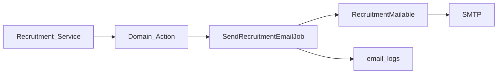

# OpRec — Notifications & Email

**Acuan:** PRD §18, §26, §28; infrastruktur M5 D-Form (`email_logs`, queue)

---

## 1. Arsitektur Notifikasi



**Prinsip:**

- Semua email non-blocking via **Laravel Queue** (Redis)
- Log sukses/gagal ke `email_logs` (perluas FK — lihat [database-design.md](database-design.md) §20)
- Template configurable via `recruitment_email_templates`
- Dedup flag untuk reminder (H-1, H-2) — simpan `reminder_h1_sent_at`, `reminder_h2_sent_at` di `recruitment_interviews`

---

## 2. Email Event Matrix (PRD §28)

| Event | Recipient | Template Key | Trigger |
|-------|-----------|--------------|---------|
| Application submitted | Applicant | `application_submitted` | `ApplicationSubmitter` success |
| Revision required | Applicant | `revision_required` | `ScreeningService` → revision |
| Passed screening | Applicant | `passed_screening` | `ScreeningService` → pass |
| Rejected (screening) | Applicant | `rejected_screening` | `ScreeningService` → reject |
| Interview scheduled | Applicant | `interview_scheduled` | `InterviewSchedulingService` |
| H-1 interview reminder | Applicant | `interview_reminder_h1` | Scheduled command |
| H-2 hour reminder | Applicant | `interview_reminder_h2` | Scheduled command |
| Final accepted | Applicant | `final_accepted` | `FinalSelectionService` → accept |
| Final rejected | Applicant | `final_rejected` | `FinalSelectionService` → reject |
| Correction request received | Staff | `correction_request_staff` | `CorrectionRequestService` → store |
| Interview assignment | Interviewer | `interview_assignment` | Interviewer assigned/reassigned |
| Interview rescheduled | Applicant | `interview_rescheduled` | Reschedule action |
| Application cancelled | Applicant | `application_cancelled` | Cancel action |

---

## 3. Template Variables

Setiap template mendukung placeholder `{{variable}}` — di-replace saat render.

### 3.1 Variables Global

| Variable | Deskripsi | Contoh |
|----------|-----------|--------|
| `{{period_name}}` | Nama recruitment period | OpRec 2026 |
| `{{organization_name}}` | DOSCOM | DOSCOM |
| `{{support_email}}` | Email panitia | oprec@doscom.org |

### 3.2 Variables Applicant

| Variable | Deskripsi |
|----------|-----------|
| `{{applicant_name}}` | Full name |
| `{{registration_number}}` | OPREC-2026-00123 |
| `{{tracking_url}}` | URL tracking (dengan instruksi login) |
| `{{nim}}` | NIM |
| `{{primary_division}}` | Nama divisi primary |
| `{{semester}}` | Semester |

### 3.3 Variables Interview

| Variable | Deskripsi |
|----------|-----------|
| `{{interview_date}}` | Tanggal (format lokal) |
| `{{interview_time}}` | Waktu mulai |
| `{{interview_location}}` | Lokasi |
| `{{interview_room}}` | Ruangan |
| `{{interviewer_name}}` | Nama interviewer |
| `{{queue_number}}` | Nomor antrean (setelah check-in) |
| `{{attendance_instructions}}` | Instruksi check-in |

### 3.4 Variables Final Result

| Variable | Deskripsi |
|----------|-----------|
| `{{final_result}}` | Accepted / Rejected |
| `{{membership_type}}` | AA / Member |
| `{{final_division}}` | Nama divisi final |
| `{{public_message}}` | Pesan untuk applicant (rejection/acceptance) |

### 3.5 Variables Staff/Interviewer

| Variable | Deskripsi |
|----------|-----------|
| `{{staff_name}}` | Nama staff (actor) |
| `{{interviewer_name}}` | Nama interviewer |
| `{{applicant_count}}` | Jumlah applicant assigned |
| `{{session_date}}` | Tanggal sesi interview |
| `{{correction_request_message}}` | Pesan correction dari applicant |

---

## 4. Template Default (Seeder)

`RecruitmentEmailTemplateSeeder` — seed subject + body HTML untuk setiap `event_type`.

Contoh `application_submitted`:

**Subject:** `[DOSCOM OpRec] Konfirmasi Pendaftaran — {{registration_number}}`

**Body (ringkas):**

```html
<p>Halo {{applicant_name}},</p>
<p>Pendaftaran OpenRecruitment DOSCOM kamu telah berhasil diterima.</p>
<p><strong>Nomor Pendaftaran:</strong> {{registration_number}}</p>
<p>Simpan email ini. Kamu akan membutuhkan nomor pendaftaran dan token tracking
   (terlampir) untuk memantau progress di:</p>
<p><a href="{{tracking_url}}">{{tracking_url}}</a></p>
```

**Penting:** Plain tracking token dikirim **hanya** di email ini (PRD §14). Jangan log plain token.

---

## 5. Job & Mailable Structure

```text
app/Jobs/Recruitment/SendRecruitmentEmailJob.php
app/Mail/Recruitment/RecruitmentNotificationMail.php
app/Services/Recruitment/RecruitmentEmailRenderer.php
app/Services/Recruitment/RecruitmentEmailDispatcher.php
```

### 5.1 SendRecruitmentEmailJob

```php
public function __construct(
    public string $templateKey,
    public string $recipientEmail,
    public array $variables,
    public ?string $recruitmentApplicationId = null,
) {}
```

Handle:

1. Load template by `event_type` (fallback hardcoded jika inactive)
2. Render subject + body via `RecruitmentEmailRenderer`
3. Send mailable
4. Log to `email_logs` with status sent/failed

### 5.2 Retry Policy

- Max 3 retries dengan backoff exponential
- Failed → log error_message di `email_logs`
- Alert admin jika failure rate > threshold (post-MVP)

---

## 6. Interview Reminders (PRD §18)

### 6.1 H-1 Reminder

- **Kapan:** 24 jam sebelum `scheduled_at`
- **Isi:** Tanggal, waktu, lokasi, ruangan, instruksi, registration number
- **Dedup:** Set `reminder_h1_sent_at` setelah kirim; skip jika sudah set

### 6.2 H-2 Jam Reminder

- **Kapan:** 2 jam sebelum `scheduled_at`
- **Isi:** Reminder singkat — waktu, lokasi, ruangan, instruksi attendance
- **Dedup:** Set `reminder_h2_sent_at`

### 6.3 Scheduled Command

```bash
php artisan recruitment:send-interview-reminders
```

Register di `routes/console.php` / `bootstrap/app.php`:

```php
Schedule::command('recruitment:send-interview-reminders')->everyFifteenMinutes();
```

Logic:

1. Query interviews WHERE status = `scheduled` AND scheduled_at within window
2. For each: check H-1 window (23–25h before) AND `reminder_h1_sent_at IS NULL`
3. For each: check H-2 window (1.5–2.5h before) AND `reminder_h2_sent_at IS NULL`
4. Skip cancelled/rescheduled irrelevant interviews
5. Dispatch email job + update sent_at

**Testing:** Use `Carbon::setTestNow()` in PHPUnit.

---

## 7. Staff Notification — Correction Request

Ketika applicant submit correction request:

- Email ke distribution list staff OU ke `correction_request_staff` template
- Recipient: configurable (env `RECRUITMENT_STAFF_EMAIL` atau users dengan role staff)
- Include link ke admin application show page

---

## 8. Interviewer Assignment Email

Trigger:

- Applicant scheduled to interview session
- Interviewer reassigned

Isi:

- Session date, time, location, room
- Division
- Link ke My Interviews dashboard

---

## 9. Email Log Integration

Perluas `email_logs` (migration OpRec-M2):

| Kolom | Tipe |
|-------|------|
| `recruitment_application_id` | uuid, nullable, FK |

Existing columns reused: `recipient_email`, `status`, `error_message`, `sent_at`.

Query audit: "Apakah applicant X sudah terima email schedule?" → filter by application_id + template/event.

---

## 10. Queue Configuration

Pastikan worker running (sama dengan D-Form M5):

```bash
php artisan queue:work redis --queue=default,emails
```

Recruitment emails menggunakan queue `emails` (atau `default` — konsisten dengan project).

---

## 11. In-App Notifications (Future)

PRD MVP fokus email. Post-MVP:

- Database notifications untuk Staff (pending screening count)
- Real-time via Laravel Echo (optional)

Tidak termasuk OpRec-M0–M11.

---

## 12. Testing Checklist

| Test | Milestone |
|------|-----------|
| Application submitted email queued | M2 |
| Screening emails on pass/revision/reject | M4 |
| Interview schedule email | M6 |
| H-1 reminder sent once | M6 |
| H-2 reminder sent once | M6 |
| No duplicate reminders | M6 |
| Final accept/reject email | M9 |
| email_logs entry created | M2+ |
| Template variable substitution | M10 |
| Failed email logged with error | M11 |

Lihat [testing-strategy.md](testing-strategy.md) untuk detail test cases.

---

## 13. Milestone Mapping

| Fitur | Milestone |
|-------|-----------|
| Confirmation email + template seed | OpRec-M2 |
| Screening notification emails | OpRec-M4 |
| Schedule + reminder command | OpRec-M6 |
| Final result emails | OpRec-M9 |
| Template admin CRUD | OpRec-M10 |
| Email delivery hardening + retry tests | OpRec-M11 |
