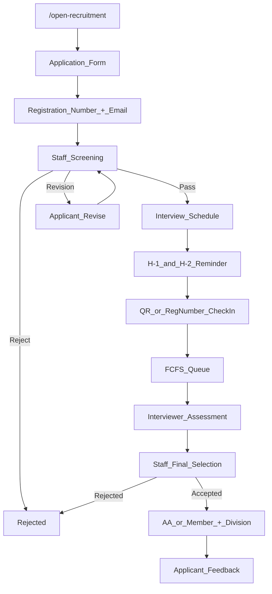

# OpRec — Overview Produk

**Acuan:** [PRD §1–7, §8–14, §44, §51, §54](../PRD%20—%20DOSCOM%20OpenRecruitment%20(OpRec).md)

---

## 1. Ringkasan Eksekutif

DOSCOM OpenRecruitment (OpRec) menggantikan proses recruitment manual yang tersebar menjadi satu workflow terstruktur, transparan, dan dapat digunakan kembali setiap periode.

Applicant mendaftar **tanpa akun** melalui `/open-recruitment`, menerima nomor pendaftaran + tracking token, dan dapat memantau progress secara mandiri.

Internal organisasi (Staff, Interviewer, Admin) mengelola seluruh proses melalui dashboard `/admin/recruitment`.

---


## 2. Visi Produk

> Menjadikan DOSCOM OpenRecruitment sebagai sistem recruitment terintegrasi yang memberikan pengalaman pendaftaran yang mudah bagi applicant serta proses seleksi yang terstruktur, transparan, dan terdokumentasi bagi organisasi.

---


## 3. Target User & Kebutuhan


### 3.1 Applicant (Guest — tanpa login)


| Kebutuhan        | Fitur                                         |
| ---------------- | --------------------------------------------- |
| Form pendaftaran | Application form dengan validasi              |
| Upload dokumen   | CV (PDF wajib), portfolio (URL atau PDF)      |
| Tracking         | Progress stage, jadwal interview, hasil akhir |
| Attendance       | Check-in QR atau registration number          |
| Feedback         | Rating & teks setelah proses selesai          |


### 3.2 Staff


| Kebutuhan            | Fitur                                             |
| -------------------- | ------------------------------------------------- |
| Applicant management | List, filter, detail, export                      |
| Screening            | Pass / Revision Required / Reject                 |
| Revision handling    | Alasan wajib, notifikasi applicant                |
| Interview management | Schedule, reschedule, reassign interviewer        |
| Final selection      | AA / Member / Rejected + final division           |
| Placement            | Penempatan divisi (boleh berbeda dari preferensi) |


### 3.3 Interviewer


| Kebutuhan                 | Fitur                                                 |
| ------------------------- | ----------------------------------------------------- |
| Daftar interview hari ini | My Interviews dashboard                               |
| Queue                     | Monitor antrean sesi yang di-assign                   |
| Assessment                | Speaking, Technical, Attitude (1–10) + recommendation |
| Applicant info            | Nama, NIM, semester, divisi, CV, portfolio            |


**Batasan:** Interviewer **tidak boleh** mengubah screening decision, final decision, membership type, atau final division.

### 3.4 Admin


| Kebutuhan           | Fitur                                          |
| ------------------- | ---------------------------------------------- |
| Recruitment period  | CRUD periode (draft/open/closed/archived)      |
| Division management | 4 divisi default + active flag                 |
| User & role         | Assign Staff, Interviewer; division assignment |
| Email template      | Subject, body, variables                       |
| System monitoring   | Activity log, reports                          |


---


## 4. Divisi & Eligibility


### 4.1 Divisi (PRD §8.1)

1. Pemrograman / Programming
2. Creative Media / Medcrev
3. Jaringan / Network
4. Data


### 4.2 Syarat Pendaftaran (PRD §8.2–8.3)

- Mahasiswa yang memenuhi ketentuan DOSCOM
- Semester **1–3** (inclusive)
- **Satu application per NIM per Recruitment Period**
- NIM sebagai identifier utama anti-duplikasi

---


## 5. Data Pendaftaran


### 5.1 Informasi Pribadi (wajib)


| Field              | Validasi                    |
| ------------------ | --------------------------- |
| Full Name          | Required                    |
| NIM                | Required, unique per period |
| Semester           | Required, 1–3               |
| Phone Number       | Required, format valid      |
| Personal Email     | Required, format valid      |
| Student Email      | Required, format valid      |
| Instagram Username | Required                    |


### 5.2 Preferensi Divisi


| Field              | Aturan                                        |
| ------------------ | --------------------------------------------- |
| Primary Division   | Required                                      |
| Secondary Division | Optional; **tidak boleh sama** dengan primary |


### 5.3 Dokumen


| Dokumen   | Aturan                                                  |
| --------- | ------------------------------------------------------- |
| CV        | Wajib, format PDF, ukuran dibatasi, private storage     |
| Portfolio | URL **atau** file PDF; sistem tahu jenis yang diberikan |


---


## 6. Application Lifecycle


### 6.1 Application Stage

```text
Submitted → Screening → Interview → Final Review → Completed
```


### 6.2 Application Result

```text
Pending → Accepted | Rejected | Cancelled
```


### 6.3 Interview Status

```text
Not Scheduled → Scheduled → Checked In → Queued → Called → In Progress → Completed
                                                                              ↘ No Show
```


### 6.4 Membership Type (hanya jika Accepted)

```text
AA | Member
```


### 6.5 Final Division

Dapat berbeda dari preferensi applicant (Programming, Creative Media, Network, Data, atau divisi lain).

---


## 7. Core Journey (MVP)




---


## 8. Applicant Tracking (Guest Portal)

Setelah submit, applicant menerima:

- **Registration Number** — contoh: `OPREC-2026-00123`
- **Tracking Token** — kredensial rahasia (plain text hanya dikirim sekali via email)

Applicant membuka `/open-recruitment/track` dengan reg number + token.

**Yang ditampilkan:** status, progress stage, jadwal interview, attendance status, hasil akhir, instruksi berikutnya.

**Yang TIDAK ditampilkan:** interviewer notes, internal screening notes, scoring detail, activity staff, data applicant lain.

---


## 9. Business Rules Ringkas (28 aturan — PRD §51)

1. Applicant hanya boleh mendaftar sekali per recruitment period.
2. Applicant hanya boleh semester 1–3.
3. Pendaftaran hanya tersedia selama recruitment period `open`.
4. Applicant dapat mengedit data sampai application diverifikasi staff.
5. Setelah verified, perubahan menggunakan correction request.
6. Screening: Pass, Revision Required, Reject.
7. Revision/Reject wajib memiliki reason.
8. Interviewer ditentukan berdasarkan division.
9. Satu applicant memiliki satu interviewer.
10. Assessment: Speaking, Technical, Attitude (1–10 each).
11. Tidak ada weighted score.
12. Interviewer memberikan recommendation, bukan final decision.
13. Attendance harus dilakukan sebelum mendapatkan queue.
14. Queue menggunakan FCFS.
15. Applicant terlambat tetap dapat interview, masuk queue terakhir.
16. Staff menentukan final decision.
17. Final result: AA, Member, atau Rejected.
18. Accepted applicant wajib memiliki final division.
19. Final division dapat berbeda dari preference applicant.
20. Applicant dapat cancel application.
21. Final rejection wajib memiliki reason.
22. Applicant menerima notification pada major stage transition.
23. Reminder interview: H-1 dan H-2 jam.
24. Applicant dapat melihat progress melalui tracking.
25. Applicant dapat memberikan feedback setelah proses selesai.
26. Data tiap Recruitment Period terisolasi.
27. Aktivitas penting dicatat dalam audit trail.
28. Registration number saja tidak cukup untuk akses data sensitif.

---


## 10. Success Metrics (PRD §6)


| Metric                                                  | Target |
| ------------------------------------------------------- | ------ |
| Seluruh applicant terdata dalam satu sistem             | 100%   |
| Applicant dapat mengetahui status tanpa hubungi panitia | 100%   |
| Screening melalui sistem                                | 100%   |
| Assessment interviewer terdokumentasi                   | 100%   |
| Attendance interview tercatat melalui sistem            | 100%   |
| Notifikasi perubahan tahap terkirim otomatis            | >95%   |
| Data final selection tersimpan                          | 100%   |
| Tidak ada duplicate application per period              | 0      |


---


## 11. Out of Scope MVP (PRD §43)

- Applicant account/login
- Mobile native app
- AI scoring / rejection / division recommendation
- WhatsApp automation
- Video interview
- Payment system
- Onboarding / HRIS integration

---


## 12. MVP Priority (PRD Appendix A)


| Feature                                                                | Priority    |
| ---------------------------------------------------------------------- | ----------- |
| Landing Page, Application Form, Registration Number, Tracking          | Must Have   |
| Screening, Revision Required, Interview Scheduling                     | Must Have   |
| Email Notification, Reminder, Attendance, Queue                        | Must Have   |
| Interview Assessment, Final Selection, Membership Type, Final Division | Must Have   |
| Audit Trail                                                            | Must Have   |
| Correction Request, Feedback, Reporting                                | Should Have |
| Advanced Analytics, AI                                                 | Future      |


